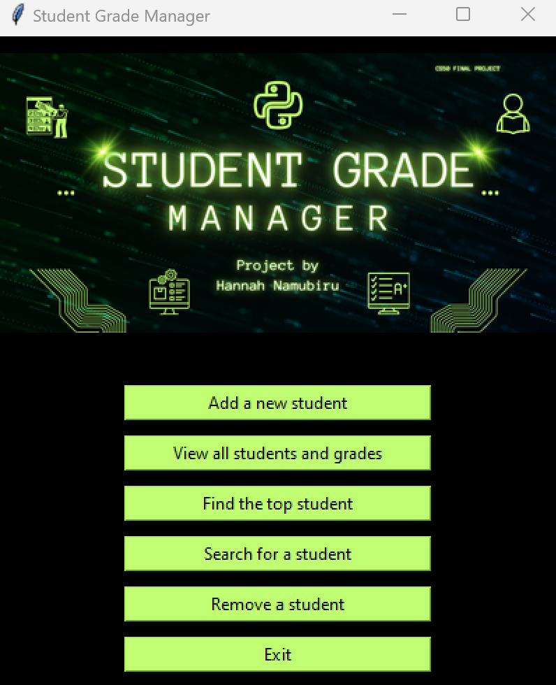
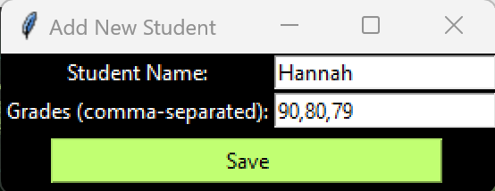
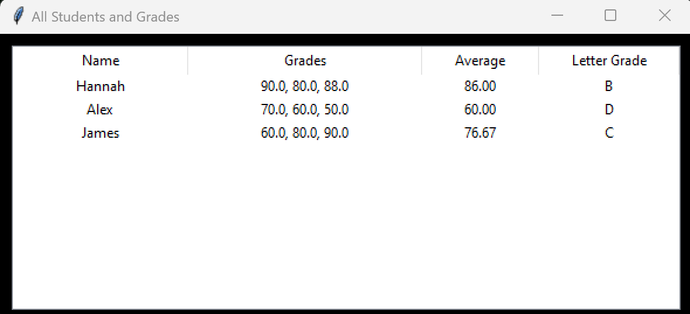
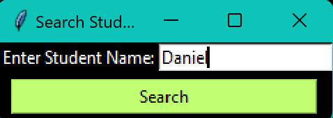
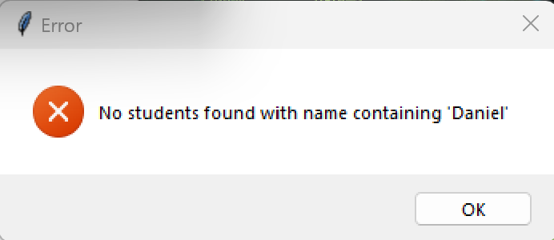

# STUDENT GRADE MANAGER


## 📹 Video Demo
You may check the demonstration video on YouTube by [clicking here](https://youtu.be/ywV9LWsAKao?si=DLwBqX-9-EQc4_QQ).


## 📄 Description
This Python-based **Student Grade Manager** application was developed as part of my final project for the CS50 course: 
*Introduction to Programming with Python*. The project allows users to manage students' grades. 
It provides a Graphic User Interface (GUI) with key features:

- **Add Students**: Input student names and their grades to track their performance.
- **View All Students and Grades**: Display a list of students with their grades, averages, median, and letter grade.
- **Find The Top Student**: Find the student with the highest average grade.
- **Search Students**: Search for students by name to view their details.
- **Remove Students**: Remove a student from the list.

---

## ⚙️ Languages or Frameworks Used
This project is developed using **Python (version 3.x)**. 
The required modules are listed in the `requirements.txt`file, 
along with instructions on how to install them to ensure the scripts run successfully.

---

## 🧮 Functions
This project contains a main function and six additional functions: three defined in the same file as the main function 
(`project.py`) and three imported from external modules. Below is a breakdown of these functions:

### **`calculate_average`** (from `project.py`)
- **Purpose**: Calculates the average of a list of grades.
- **Explanation**: Takes a list of grades, checks if the list is not empty, and then calculates the sum of the grades 
divided by the number of grades to determine the average.

```python
def calculate_average(grades):
    """Calculate the average of a list of grades."""
    if not grades:
        raise ValueError("Grades list cannot be empty.")
    return sum(grades) / len(grades)
```

### **`determine_grade`** (from `project.py`)
- **Purpose**: Determines the letter grade based on the average.
- **Explanation**: Takes an average grade and returns the corresponding letter grade according to predefined thresholds.

```python
def determine_grade(average):
    """Determine the letter grade based on the average."""
    if average >= 90:
        return "A"
    elif average >= 80:
        return "B"
    elif average >= 70:
        return "C"
    elif average >= 60:
        return "D"
    else:
        return "F"
```

### **`get_top_student`** (from `project.py`)
- **Purpose**: Finds the student with the highest average grade.
- **Explanation**: Applies the `calculate_average` function to all students and returns the student 
with the highest average.

```python
def get_top_student(student_data):
    """Find the student with the highest average grade."""
    if not student_data:
        raise ValueError("Student data cannot be empty.")
```

### **`calculate_median`** (from `calculate_median.py`)
- **Purpose**: Calculates the median grade for a student.
- **Explanation**: Uses Python's built-in `statistics.median` to compute the median of the grades and raises an error 
if the list is empty.

```python
import statistics

def calculate_median(grades):
    """Calculate the median grade for a student."""
    if not grades:
        raise ValueError("Grades list cannot be empty.")
    return statistics.median(grades)
```

### **`search_student`** (from `search_student.py`)
- **Purpose**: Searches for students by name containing the given key.
- **Explanation**: Filters through the student data and returns a list of students whose names contain the search key. 
If no matches are found, raises an error with a message saying no students match the search.

```python
def search_student(student_data, key):
    """Search for students by name containing the given key and return their details."""
    results = [student for student in student_data if key.lower() in student["name"].lower()]
    if not results:
        raise ValueError(f"No students found with name containing '{key}'")
    return results
```

### **`remove_student`** (from `remove_student.py`)
- **Purpose**: Removes a student by name from the system.
- **Explanation**: Looks for the first student with a matching name and removes them from the student list. 
If no match is found, raises an error.

```python
def remove_student(student_data, name):
    """Remove a student by name from the system."""
    for student in student_data:
        if student["name"].lower() == name.lower():
            student_data.remove(student)
            return f"Student '{name}' has been removed."
    raise ValueError(f"Student with name '{name}' not found.")
```

---

## 🌟 How to Run
1. Download the latest zip from above or clone the repository from 
[GitHub](https://github.com/hannahkiwummulonamubiru/cs50_final_project).
2. Install the required Python modules listed in the `requirements.txt` file.
3. Run `grade_manager_GUI.py` to interact with the Student Grade Manager with GUI
4. Select the option you want to choose by clicking the button.

---

## 📺 Demo
Here are some examples of the script in action:

1. **Menu**

2. **Add a new student to the list.**

3. **Display a list of students with their grades, averages, median, and letter grade.**

4. **Search for a student**

If no students' names contain matches with data
the program returns an error message: 



---

## 🔑 Key Knowledge Areas
1. **Variables and Data Types**:
   - Lists, dictionaries, strings, numbers.
2. **Functions**:
   - Defining functions using `def`, passing arguments, returning values, error handling.
3. **Control Flow**:
   - Conditional statements: Using `if`, `elif`, and `else` to make decisions.
   - Loops: Iterating through lists (e.g., `for student in student_data:`).
4. **Error Handling**:
   - Using `try`, `except`, and raising exceptions.
5. **Built-in Functions**:
   - `sum()`, `len()`, `max()`, `statistics.median()`.
6. **String and List Operations**:
   - String manipulation (e.g., `.lower()` for case-insensitive comparison).
   - List comprehensions, searching, and filtering.
7. **Modular Programming**:
   - Organizing code into different files and functions for reusability 
   (e.g., `calculate_median.py`, `search_student.py`, `remove_student.py`).

---

## 🤖 Author
This project is made by **Hannah Namubiru**.

- GitHub Profile: [Hannah Namubiru](https://github.com/hannahkiwummulonamubiru)
